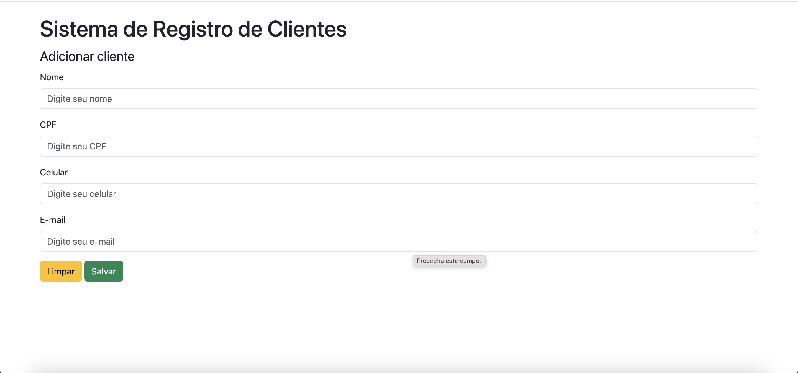
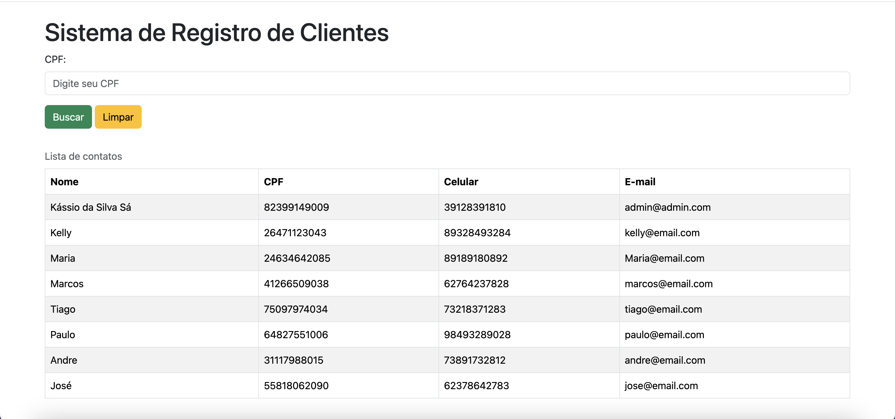

<h1 align="center">
  Sistema de Registro de clientes
</h1>

  
  

## 💻 Sobre o projeto

Este sistema foi feito para colocar em prática os conceitos aprendidos na disciplina de estrutura de dados. Ele usa as
tecnologias web mais recentes do mercado.

## ⚙️ Funcionalidades

- Cadastro de clientes
- Listagem de clientes e uma rápida pesquisa por CPF

## 🛠 Tecnologias

As seguintes ferramentas foram usadas na construção do projeto:

- Java
- Spring
- Thymeleaf (template engine para construir o front)

## 🚀 Como executar o projeto

1. Antes de tudo tenha certeza que você tem o ambiente Java 17 configurado na sua máquina.
2. Depois clone o projeto
3. Agora basta abrir o projeto no Intellij e executar
